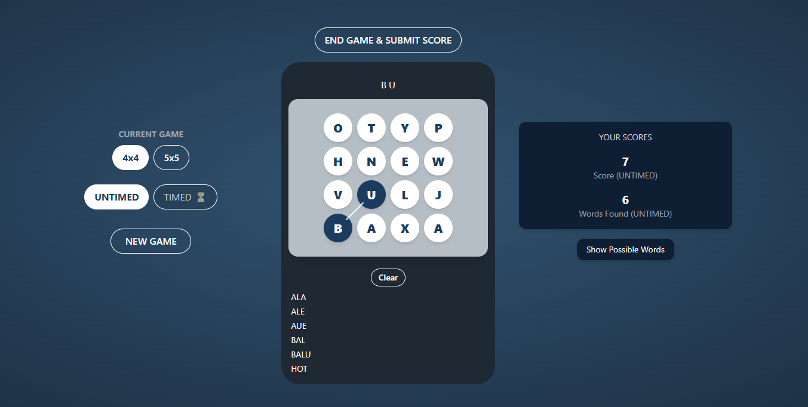

# Boggle Game

This project is a web-based implementation of the classic word game **Boggle**, developed using **React** and **TypeScript**. In Boggle, players form words by connecting adjacent letters (horizontally, vertically, or diagonally) on a grid. The game supports two board sizes (4x4 and 5x5) and two game modes (Timed and Untimed). It leverages React Query for data fetching and caching, TypeScript for type safety, and Jest with React Testing Library for unit testing. The application features a responsive user interface, score tracking, and a dictionary validation system to ensure only valid words are accepted.

The game also includes a possible words feature that computes and displays all valid words that can be formed on the current board, helping players understand the board's potential. The UI is designed to be responsive, accessible, and styled with Tailwind CSS.

**Live Preview**: Try the game online at [https://boggle-game-demo.netlify.app](https://boggle-game-demo.netlify.app).

## Screenshot



## Features

- **Dynamic Board Sizes**: Players can switch between 4x4 and 5x5 grids.
- **Game Modes**:
  - **Untimed**: Play without a time limit.
  - **Timed**: Play with a 180-second timer, which resets on starting a new game.
- **Word Validation**: Validates words against a dictionary fetched from `/words.txt`.
- **Score Tracking**:
  - Words with fewer than 3 letters: 0 points
  - 3 letters: 1 point
  - 4 letters: 2 points
  - 5 letters: 3 points
  - 6 letters: 5 points
  - 7 or more letters: Points equal to the word length
- **Interactive UI**:
  - Click tiles to form words, clear selections, start new games, and end the game to submit the score.
  - Displays the current word being formed and a list of submitted words.
- **Possible Words**:
  - Computes and displays the number of possible words that can be formed on the current board.
  - Shows a scrollable list of possible words, with a loading spinner during computation.
- **Accessibility**:
  - Supports keyboard navigation (e.g., Escape to clear selection, letter keys to form words).
  - Includes ARIA labels for tiles and interactive elements.
- **Responsive Design**: Adapts to various screen sizes, ensuring usability on both mobile and desktop devices.
- **Unit Tests**: Includes comprehensive tests for components, utilities, and hooks.

### Technologies Used
- **React**: Frontend library for building the user interface.
- **TypeScript**: Ensures type safety and improves the developer experience.
- **React Query**: Manages data fetching, caching, and state (e.g., dictionary loading, computing possible words).
- **Tailwind CSS**: Provides utility-first styling for the UI.
- **Jest & React Testing Library**: Enables unit testing for components, utilities, and hooks.
- **Vite**: Serves as the build tool for the project.

## Project Structure

The project is organized under the `src` directory with a modular structure:

```
boggle/
├── src/
│   ├── app/
│   │   ├── index.ts
│   │   └── provider.ts
│   ├── assets/
│   │   └── logo.svg
│   ├── component/
│   │   └── layout/
│   │       ├── board/
│   │       │   ├── board.tsx
│   │       ├── index.ts
│   │       └── ui/
│   │           ├── spinner/
│   │           │   ├── spinner.tsx
│   │           ├── index.ts
│   ├── features/
│   │   └── layout/
│   │       ├── board/
│   │           ├── board.tsx
│   │           ├── board-grid.tsx
│   │           ├── game-controls.tsx
│   │           ├── index.ts
│   │           ├── score-display.tsx
│   │           ├── set-timer.tsx
│   ├── constants/
│   │       ├── types/
│   │       │   ├── index.ts
│   │       ├── index.ts
│   ├── hooks/
│   │   ├── index.ts
│   │   ├── use-dictionary.ts
│   │   └── use-game-reducer.ts
│   ├── tests/
│   │   ├── component/
│   │   │   ├── board/
│   │   │   │   └── index.test.tsx
│   │   │   ├── board-grid/
│   │   │   │   └── index.test.tsx
│   │   │   ├── game-controls/
│   │   │   │   └── index.test.tsx
│   │   │   ├── score-display/
│   │   │   │   └── index.test.tsx
│   │   └── utils/
│   │       ├── board/
│   │       │   └── index.test.tsx
│   │       ├── config/
│   │       │   └── index.test.tsx
│   │       ├── game/
│   │       │   └── index.test.tsx
│   │       ├── multiplayer/
│   │       │   └── index.test.tsx
│   │       ├── scoring/
│   │       │   └── index.test.tsx
│   ├── utils/
│   │   ├── board.ts
│   │   ├── cn.ts
│   │   ├── config.ts
│   │   ├── game.ts
│   │   ├── index.ts
│   │   ├── scoring.ts
│   └── (other files like vite.config.ts, tsconfig.json, package.json, etc.)
├── README.md
```

## Installation and Setup

1. **Clone the Repository**:

   ```bash
   git clone https://github.com/muhammadzubairbaig/boggle-game
   cd boggle-game
   ```

2. **Install Dependencies**:

   Ensure Node.js (version 16 or higher) is installed, then run:

   ```bash
   npm install
   ```

   The required dependencies in `package.json` should include:

   ```json
   {
     "dependencies": {
       "react": "^18.2.0",
       "react-dom": "^18.2.0",
       "@tanstack/react-query": "^4.0.0",
       "tailwindcss": "^3.0.0"
     },
     "devDependencies": {
       "@testing-library/react": "^14.0.0",
       "@testing-library/jest-dom": "^5.16.5",
       "@types/jest": "^29.5.5",
       "@types/react": "^18.2.0",
       "@types/react-dom": "^18.2.0",
       "jest": "^29.7.0",
       "jest-environment-jsdom": "^29.7.0",
       "ts-jest": "^29.1.1",
       "typescript": "^5.0.0",
       "vite": "^4.0.0"
     }
   }
   ```

3. **Configure TypeScript**:

   Ensure `tsconfig.json` is configured to resolve the `@` alias for module imports:

   ```json
   {
     "compilerOptions": {
       "baseUrl": "src",
       "paths": {
         "@/*": ["*"]
       },
       "target": "ESNext",
       "module": "ESNext",
       "jsx": "react-jsx",
       "strict": true,
       "moduleResolution": "node",
       "esModuleInterop": true,
       "skipLibCheck": true
     }
   }
   ```

4. **Configure Jest**:

   Set up `jest.config.cjs` to support TypeScript and the `@` alias:

   ```javascript
   module.exports = {
     preset: 'ts-jest',
     testEnvironment: 'jsdom',
     setupFilesAfterEnv: ['<rootDir>/src/setupTests.ts'],
     moduleNameMapper: {
       '^@/(.*)$': '<rootDir>/src/$1'
     }
   };
   ```

5. **Set Up Test Environment**:

   Create a `setupTests.ts` file to configure global mocks for testing:

   ```typescript
   import '@testing-library/jest-dom';

   global.fetch = jest.fn();
   ```

6. **Provide the Dictionary File**:

   - Place a `public/words.txt` file in the project root with a list of valid words (one word per line). Example:

     ```
     eat
     cat
     hat
     hello
     ```

   - This file is used by the `useDictionary` hook to validate words during gameplay.

## Running the Application

1. **Start the Development Server**:

   ```bash
   npm run dev
   ```

   This launches the Vite development server, typically accessible at `http://localhost:3000`.

2. **Build for Production**:

   ```bash
   npm run build
   ```

   This generates a production-ready build in the `dist` directory.

3. **Run Tests**:

   ```bash
   npm test
   ```

   This executes the Jest test suite. To view test coverage, use:

   ```bash
   npm test -- --coverage
   ```

   Expected test output:

   ```
   PASS  src/tests/component/board/index.test.tsx
   PASS  src/tests/component/board-grid/index.test.tsx
   PASS  src/tests/component/game-controls/index.test.tsx
   PASS  src/tests/component/score-display/index.test.tsx
   PASS  src/tests/component/timer/index.test.tsx
   PASS  src/tests/utils/board/index.test.tsx
   PASS  src/tests/utils/config/index.test.tsx
   PASS  src/tests/utils/game/index.test.tsx
   PASS  src/tests/utils/scoring/index.test.tsx
   ```

## Usage

1. **Game Interface**:

   - **Board**: Displays a grid of letters (4x4 or 5x5). Click adjacent tiles to form words.
   - **Controls**: Includes buttons to:
     - Switch between 4x4 and 5x5 boards.
     - Select between Untimed and Timed modes.
     - Start a new game.
   - **Score Display**: Shows the current score, number of words found, and game mode.
   - **Clear Button**: Resets the current tile selection.
   - **End Game Button**: Ends the game and displays the final score (available in Untimed mode).
   - **Possible Words Section**: Displays the number of possible words on the board and a scrollable list of those words.
   - **Timer**: In Timed mode, a 180-second countdown timer is shown.

2. **Playing the Game**:

   - Click tiles to form a word by selecting adjacent letters (horizontally, vertically, or diagonally).
   - Words must be at least 3 letters long (4 letters for a 5x5 board) and must exist in the dictionary.
   - Valid words are automatically submitted, added to the score, and listed in the submitted words section.
   - Use the "Clear" button to reset the current selection.
   - In Timed mode, find as many words as possible within 180 seconds.
   - End the game manually in Untimed mode or wait for the timer to run out in Timed mode to view the final score.
   - Check the list of possible words to explore the board’s potential (displayed with a loading spinner during computation).

3. **Keyboard Navigation**:
   - Press `Escape` to clear the current selection.
   - Press letter keys (A-Z) to attempt forming words if a valid path exists.
   - Press `Backspace` to clear the current selection.

## Codebase Details

### Components

#### 1. `Board.tsx`
- **Purpose**: The primary component that manages the Boggle game, rendering the board, controls, score display, and possible words section.
- **Key Features**:
  - Uses custom hooks to manage game state and dictionary validation.
  - Computes the list of possible words that can be formed on the board.
  - Displays a loading spinner during computation and a scrollable list of possible words.
  - Supports keyboard navigation for accessibility.
- **Props**: None (manages state internally via hooks).
- **Dependencies**:
  - `useGameReducer`: Manages the game state (board, score, submitted words, etc.).
  - `useDictionary`: Provides the dictionary for word validation.
  - `BoardGrid`, `GameControls`, `ScoreDisplay`, `Timer`: Child components for rendering the UI.

#### 2. `BoardGrid.tsx`
- **Purpose**: Renders the grid of letter tiles and handles tile click interactions.
- **Props**:
  - `board`: A 2D array of letters (`string[][]`).
  - `selectedPath`: An array of currently selected positions (`Position[]`).
  - `onTileClick`: A callback to handle tile clicks (`(row: number, col: number) => void`).
  - `boardSize`: The size of the board (`number`).
- **Features**:
  - Displays a grid of clickable tiles with letters.
  - Highlights selected tiles with a distinct background color.
  - Includes ARIA labels for accessibility.

#### 3. `GameControls.tsx`
- **Purpose**: Renders buttons for controlling the game, such as board size, game mode, and starting a new game.
- **Props**:
  - `gameMode`: The current game mode (`'TIMED' | 'UNTIMED'`).
  - `boardSize`: The current board size (`4 | 5`).
  - `onGameModeChange`: A callback to change the game mode (`(mode: 'TIMED' | 'UNTIMED') => void`).
  - `onBoardSizeChange`: A callback to change the board size (`(size: 4 | 5) => void`).
  - `onNewGame`: A callback to start a new game (`() => void`).
- **Features**:
  - Buttons to switch between 4x4 and 5x5 boards.
  - Buttons to switch between Timed and Untimed modes.
  - A button to start a new game.

#### 4. `ScoreDisplay.tsx`
- **Purpose**: Displays the player’s score, number of words found, and current game mode.
- **Props**:
  - `score`: The player’s current score (`number`).
  - `wordsFound`: The number of words found (`number`).
  - `gameMode`: The current game mode (`'TIMED' | 'UNTIMED'`).
- **Features**:
  - Displays the score and words found in a styled card.
  - Shows the game mode for context.

#### 5. `Timer.tsx`
- **Purpose**: Displays a countdown timer for the Timed game mode.
- **Props**:
  - `onTimeUp`: A callback triggered when the timer reaches 0 (`() => void`).
  - `isRunning`: Indicates whether the timer is running (`boolean`).
  - `resetKey`: A key to reset the timer (`number`).
- **Features**:
  - Counts down from 180 seconds in Timed mode.
  - Resets when a new game starts (via `resetKey`).

### Hooks

#### 1. `useDictionary.ts`
- **Purpose**: Fetches the dictionary from `/words.txt` and manages its state.
- **Features**:
  - Uses a singleton pattern to fetch the dictionary only once.
  - Implements retry logic (up to 3 attempts) for fetching the dictionary.
  - Returns a `Set<string>` of valid words and an error message if the fetch fails.
- **Usage**:
  ```tsx
  const { dictionary, error } = useDictionary();
  ```

#### 2. `useGameReducer.ts`
- **Purpose**: Manages the game state using a reducer.
- **Props**:
  - `boardSize`: The size of the board (`number`).
  - `dictionary`: A set of valid words (`Set<string>`).
- **Features**:
  - Manages state for the board, selected path, current word, submitted words, score, game mode, and timer.
  - Provides action dispatchers for user interactions (e.g., `handleClick`, `handleClear`, `handleNewGame`).
- **State**:
  - `board`: A 2D array of letters.
  - `selectedPath`: An array of selected positions.
  - `currentWord`: The word currently being formed.
  - `submittedWords`: A list of submitted words.
  - `score`: The player’s score.
  - `isRunning`: Indicates whether the game is running (for Timed mode).
  - `timeUp`: Indicates whether the game has ended (timer ran out or ended manually).
  - `gameMode`: The current game mode.
  - `resetKey`: A key to reset the timer.

### Utilities

#### 1. `board.ts`
- **Purpose**: Provides functions for generating the board and finding paths for words.
- **Functions**:
  - `generateBoard(size: number): string[][]`: Generates a random board of the given size.
  - `findPath(word: string, board: string[][], size: number): Position[] | null`: Finds a valid path for a word on the board using depth-first search (DFS).

#### 2. `config.ts`
- **Purpose**: Defines game rules and configurations.
- **Functions**:
  - `getMinWordLength(boardSize: number): number`: Returns the minimum word length (3 for 4x4, 4 for 5x5).

#### 3. `game.ts`
- **Purpose**: Validates paths and words on the board.
- **Functions**:
  - `isValidPath(path: Position[], word: string, board?: string[][]): boolean`: Checks if a path is valid (tiles are adjacent and match the word if `board` is provided).

#### 4. `scoring.ts`
- **Purpose**: Calculates scores for words based on their length.
- **Functions**:
  - `getWordScore(word: string): number`: Returns the score for a word based on the scoring rules.

#### 5. `cn.ts`
- **Purpose**: A utility for merging Tailwind CSS class names.
- **Functions**:
  - `cn(...classes: string[]): string`: Combines multiple class names into a single string.

### Types

#### `src/constants/types/index.ts`
- **Purpose**: Defines TypeScript types for the game.
- **Types**:
  - `Position`: `{ row: number; col: number }` (position of a tile on the board).
  - `GameState`: Interface for the game state (board, score, etc.).
  - `BoardSize`: Union type for board sizes (`4 | 5`).

### Tests

#### Component Tests
- **Board**: Tests rendering, error handling, and interactions (e.g., clicking tiles, starting a new game).
- **BoardGrid**: Tests rendering of tiles, highlighting selected tiles, and click events.
- **GameControls**: Tests rendering of buttons and click events for changing board size, game mode, and starting a new game.
- **ScoreDisplay**: Tests rendering of score, words found, and game mode.
- **Timer**: Tests timer countdown, reset behavior, and `onTimeUp` callback.

#### Utility Tests
- **Board**: Tests board generation and path finding.
- **Game**: Tests path validation (adjacency and word matching).
- **Scoring**: Tests score calculation for different word lengths.
- **Config**: Tests minimum word length rules.

## Known Issues and Limitations

- **Dictionary Dependency**: The application requires a `public/words.txt` file. If this file is missing or inaccessible, word validation will fail, and an error message will be displayed.
- **Performance**: Computing the list of possible words for a large dictionary can be slow, as no optimizations (e.g., pre-filtering words) are currently implemented.
- **Styling**: The project uses Tailwind CSS. If a different styling solution is preferred, the `className` props and `cn` utility will need to be updated accordingly.

## Future Improvements

- **Additional Game Modes**: Introduce new modes, such as a "Challenge Mode" with specific word goals.
- **Performance Optimization**: Optimize the `findPath` function for larger boards using memoization or a more efficient algorithm.
- **Enhanced UI**: Add animations for tile selection and word submission to improve the user experience.
- **Multiplayer Support**: Implement a multiplayer mode using WebSockets or a backend service.
- **Improved Accessibility**: Enhance accessibility by adding ARIA labels and keyboard navigation for all interactive elements.
- **Code Quality and Testing Enhancements**:
  - Integrate **ESLint** and **Prettier** to enforce consistent code style and catch potential issues early.
  - Implement **Storybook** to develop, document, and test UI components in isolation, improving component reusability and design consistency.
  - Add **Playwright** for end-to-end testing to ensure the application works as expected across different browsers and devices.
---
